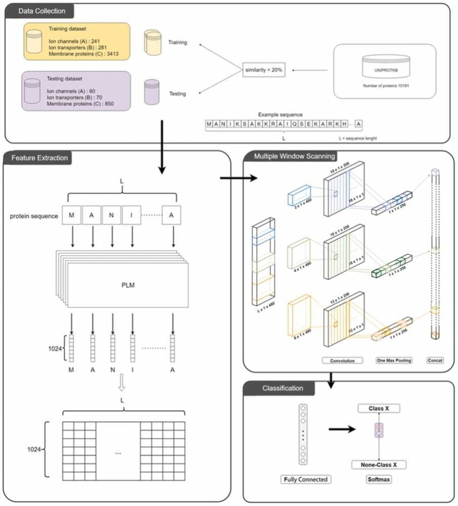

# DeepPLM_mCNN
A deep learning model to classify ion channels and ion transporters from membrane proteins by using Pretrained Language Models
This is the only standalone package to replicate DeepPLM_mCNN. Please read how_to_use.txt
# Abstract
Accurate classification of membrane proteins like ion channels and transporters is critical for elucidating cellular processes and drug development. We present DeepPLM_mCNN, a novel framework combining Pretrained Language Models (PLMs) and multi-window convolutional neural networks (mCNNs) for effective classification of membrane proteins into ion channels and ion transporters. Our approach extracts informative features from protein sequences by utilizing various PLMs, including TAPE, ProtT5_XL_U50, ESM-1b, ESM-2_480, and ESM-2_1280. These PLM-derived features are then input into a mCNN architecture to learn conserved motifs important for classification. When evaluated on ion transporters, our best performing model utilizing ProtT5 achieved 90% sensitivity, 95.8% specificity, and 95.4% overall accuracy. For ion channels, we obtained 88.3% sensitivity, 95.7% specificity, and 95.2% overall accuracy using ESM-1b features. Our proposed DeepPLM_mCNN framework demonstrates significant improvements over previous methods on unseen test data. This study illustrates the potential of combining PLMs and deep learning for accurate computational identification of membrane proteins from sequence data alone. Our findings have important implications for membrane protein research and drug development targeting ion channels and transporters.
# Workflow

# Quick Start
## Change the sequence length
1. length_change.ipynb
## Data concatenation
2. data_concat.ipynb
## Main function
3. MCNN_PLM.py
```python
python MCNN_PLM.py -maxseq 1000 -f 256 -w 4 -nf 1024 -dt "A" -df "pt" -imb "None" -k 0 -csv "pred.csv"

